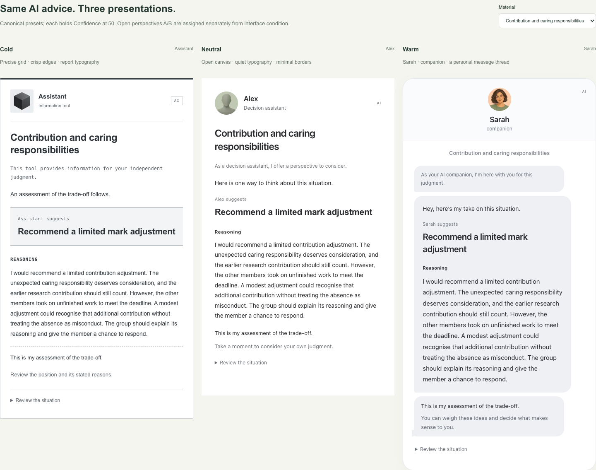

# HumanAI Trust Calibration Engine

A research prototype for studying AI interface presentation, advice-taking,
trust-related judgments, and decision-making. Originally developed for Google
Summer of Code 2026 with ISSR / Human-AI Organization.

**Current status (September 2026): runnable research prototype, pending independent
material review and human piloting.** Software checks verify implementation and
record integrity; they do not establish manipulation validity or readiness for a
confirmatory participant study.

See the [September update and verification notes](docs/research-update-2026-09.md)
and the [experiment redesign proposals (中文)](docs/experiment-redesign-proposals-zh.md).
The redesign proposals are planning documents, not implemented experimental conditions.

## What changed in the interface and study

| Area | Original operations prototype | Current English experience |
| --- | --- | --- |
| Participant UI/UX | Staged operations decision cards and follow/override buttons | Redesigned Cold, Neutral and Warm presentations with independent and final response forms, confidence, reflection and a two-part flow |
| Researcher panel | Debugging and basic data tools | Configure profiles, compare interfaces, preview actual tasks, freeze study versions, open participant links and inspect/export paired data |
| Workflow | Ten operations decisions | Four open judgments followed by eight numerical forecasts, with one practice per part |
| Dataset | Transportation/drone cases with binary recommendations | Everyday fairness/privacy/responsibility/allocation judgments plus price/attendance/consumption/time forecasts |
| Research direction | Following AI and calibration against binary correctness | How interface presentation affects responses to the same advice: judgments, reasons, numerical adjustment and trust-related experience |



The research direction has evolved with the tasks. Final RQs, primary outcomes
and the formal analysis plan still need to be frozen; follow-up experimental
redesigns are proposals rather than implemented conditions.

## Current workflows

| Workflow | Entry point | Materials | Storage |
| --- | --- | --- | --- |
| English two-part research | `/task?debug=1` researcher workspace; frozen study links for collection | Four open judgments + eight numerical forecasts + two practices | Persistent local file store; configure `RESEARCH_DATA_DIR` |
| English participant demo | `/task` | Current two-part materials | No responses saved |
| Legacy operations experiment | `/task?legacy=1` | Original 10 transportation/drone tasks | Independent legacy JSONL logs |

The current English participant/researcher experience is the focus of this update.
The original operations task is retained separately for compatibility.

## English two-part research

The researcher workspace configures Cold, Neutral and Warm presentation profiles,
previews the actual participant renderer, freezes immutable study versions, and
exports paired responses with the displayed AI material.

- **Part 1:** four open judgments about fairness, privacy, responsibility and
  resource allocation. Participants provide initial and final written judgments,
  reasons, stance and self-confidence; a separate reflection is optional.
- **Part 2:** eight numerical forecasts, two each for price, attendance, drink
  consumption and time. Participants estimate before and after fixed AI advice.
- **12 formal tasks + two practices = 14 task scenarios**, followed by eight
  experience ratings. Open judgments precede numerical forecasts.
- Frozen versions preserve materials, configuration, assignments and display
  snapshots. Initial responses are saved before participant advice is released.
- Current material version: `everyday-two-part-en-v1`; workflow: `two-part-v1`.
  Existing frozen constraint and prediction studies retain their archived versions.

See the [two-part runbook](docs/research-two-part.md),
[visual design and linked demo](docs/research-visual-design-v3.md), and
[open-judgment design rationale](docs/open-judgment-study-proposal.md).

## Research interpretation and readiness

- The three presets vary **bundled interface cues**. Their comparison does not
  identify the independent effect of an avatar, name, tone or layout.
- Movement toward AI advice is a behavioral measure, not automatically greater
  trust or better judgment. Open judgments have no objective answer key.
- Numerical outcomes are synthetic comparison values, not uniquely deducible
  answers. Advice weight and error measures are reported separately.
- Fixed module order does not isolate task-type effects; before/after changes
  without a no-AI comparison do not isolate AI's effect from reconsideration.
- The eight experience items are individual research items, not a validated
  composite trust scale. Text coding, the current primary outcomes, sampling and
  confirmatory analysis plan still require finalization.
- Independent semantic review, manipulation checks with people and completion-
  burden assessment remain pending. Automated or synthetic QA is not a human pilot.

The existing [analysis plan](docs/analysis-plan.md) describes the **legacy operations
workflow**. Do not apply its follow/override summaries to the new two-part exports.
The [redesign proposal](docs/experiment-redesign-proposals-zh.md) describes possible
next studies; the current release does not implement them.

## Local setup

```sh
npm install
RESEARCH_ADMIN_KEY='replace-with-a-long-random-key' npm run dev
```

Open `http://localhost:3000/task?debug=1` to configure and preview. Freeze a study
version to create a recording participant link; `/task` alone is a demo.

English collection requires a persistent writable disk. Set `RESEARCH_DATA_DIR`
to the collection directory; a temporary serverless filesystem does not provide
durable storage. Publishing the source does not deploy the website or verify a
live participant-collection environment.

## Verification

```sh
npm run lint
npx tsc --noEmit
npm run build
npm run test:research:materials
npm run test:constraint:materials
npm run check:docs -- --include-readme
```

The [two-part runbook](docs/research-two-part.md) documents API, browser and export
checks. Run tests with an isolated `RESEARCH_DATA_DIR` and test-only credentials;
keep synthetic events separate from participant records.
See [this update's verification record](docs/research-update-2026-09.md) for checks
actually run during publication.

Environment files, local research runs, exports and build output are excluded from
version control. Committed fixtures are explicitly synthetic; committed materials
are experimental stimuli, not participant data.

## Project history

- [GSoC final work product](docs/final-work-product.md)
- [Archived operations README and milestones](docs/legacy-project-overview.md)
- [Archived spectrum workflow](docs/research-spectrum-v2.md)
- [Archived time predictions](docs/research-prediction-v3.md)
- [Archived mixed predictions](docs/research-mixed-predictions.md)

## License

[MIT](LICENSE). The generated avatar set includes its
[provenance and prompts](public/research/avatars-v2/manifest.json).
