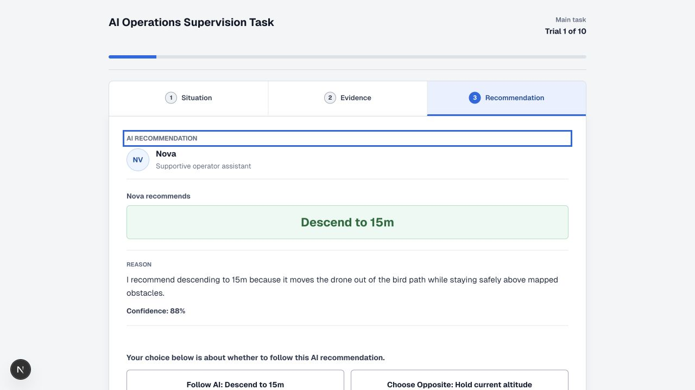
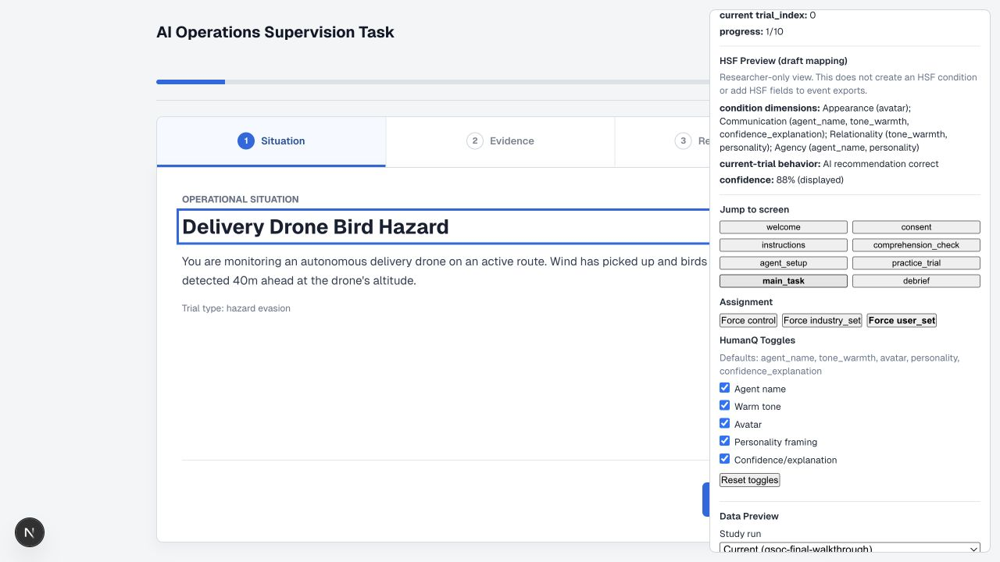
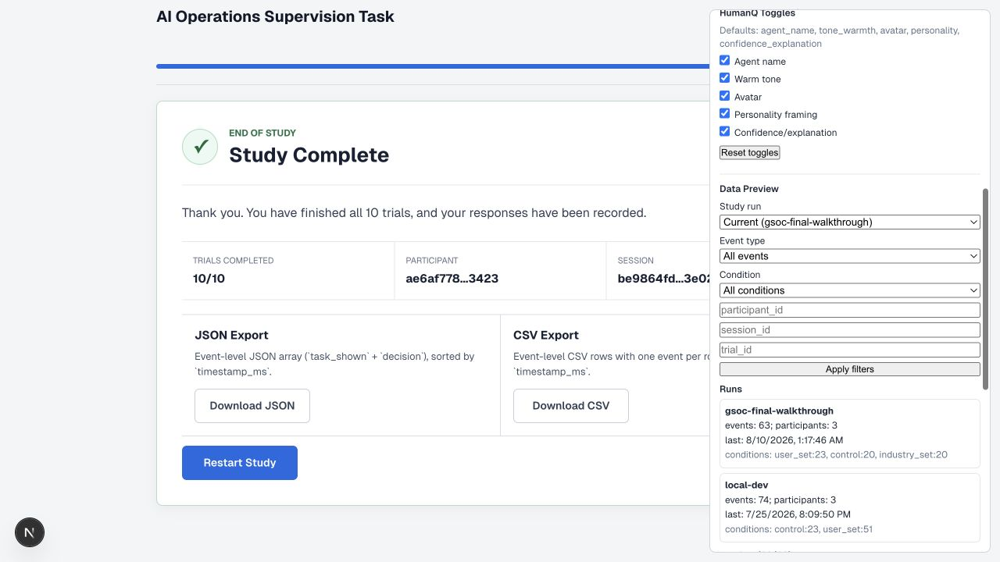

# HumanAI Trust Calibration Engine — GSoC 2026 Final Work Product

| Field | Details |
| --- | --- |
| Contributor | Runchu (Rachel) Wu |
| Mentoring organization | ISSR / Human-AI Organization |
| Mentor | Andrya Allen|
| Program | Google Summer of Code 2026 |
| Project repository | [RunchuWu/humanai-trust-engine](https://github.com/RunchuWu/humanai-trust-engine) |
| Complete commit history | [All project commits](https://github.com/RunchuWu/humanai-trust-engine/commits/main/) |
| Final snapshot | [`gsoc-2026-final`](https://github.com/RunchuWu/humanai-trust-engine/tree/gsoc-2026-final) ([tagged commit](https://github.com/RunchuWu/humanai-trust-engine/commit/gsoc-2026-final)) |

## Executive Summary

The HumanAI Trust Calibration Engine is a web-based research platform for
studying how people calibrate trust in AI-assisted operational decisions. A
participant reviews a transportation or drone-operations scenario, examines
the available evidence and an AI recommendation, and then chooses whether to
follow or override the AI.

The final GSoC work product is a working, documented, and reproducibly tested
experimental platform. It includes a complete participant flow, three
configurable cue-source conditions, fixed operations stimuli, trust-calibration
event logging, filtered JSON/CSV exports, researcher inspection tools,
accessibility improvements, and deterministic pilot-data QA. The platform is
ready for controlled internal review and for the research team to extend after
approving the next HSF-aligned study design.

This repository is the standalone primary repository for the project. There is
no separate upstream repository or unreported pull request. All 2026 GSoC work
described below was completed in this repository.

## What I Completed

### 1. Participant experiment flow

- Built the complete sequence from welcome and consent through instructions,
  comprehension check, optional agent setup, practice, ten main trials, and
  debrief.
- Implemented stable participant and condition assignment plus a new session
  identity for each page-entry session.
- Added staged disclosure of the operational situation, evidence, and AI
  recommendation, with direct and backward review navigation.
- Supported reviewing previous trials and revising a submitted decision while
  preserving the event history needed for latest-decision analysis.

Evidence: [experiment configuration](../src/lib/experiment-config.ts),
[participant interface](../src/app/task/page.tsx), and
[full task-flow milestone](https://github.com/RunchuWu/humanai-trust-engine/commit/a650b43).



### 2. Operations stimuli and configurable AI cues

- Migrated the prototype from job screening to transportation and drone
  operations.
- Created ten fixed runtime trials covering routing/dispatch, self-driving
  maneuvers, target identification, and hazard evasion.
- Implemented `control`, `industry_set`, and `user_set` conditions with modular
  agent-name, tone/warmth, avatar, personality, and confidence/explanation
  cues.
- Added a structured 16-record review-only stimulus bank and automated checks
  for balance, reading load, and synchronization with the ten runtime trials.

Evidence: [runtime trials](../src/lib/trials.ts), [cue configuration](../src/lib/cue-config.ts),
[operations migration](https://github.com/RunchuWu/humanai-trust-engine/commit/a257fca),
[modular cue framework](https://github.com/RunchuWu/humanai-trust-engine/commit/24b22d5), and
[stimulus validation milestone](https://github.com/RunchuWu/humanai-trust-engine/commit/4c36932).

### 3. Behavioral logging and reproducible export

- Defined typed and validated `task_shown` and `decision` events.
- Recorded participant, session, study-run, condition, trial, latency,
  AI-recommendation, ground-truth, follow-AI, AI-correctness, and cue metadata.
- Grouped append-only JSONL events by study run and added manifests for
  traceable local research sessions.
- Built filtered JSON and CSV exports plus reusable validation and summary
  scripts for downstream trust-calibration analysis.

Evidence: [event schema](event-schema.md), [storage and export implementation](../src/lib/event-store.ts),
[study-run storage milestone](https://github.com/RunchuWu/humanai-trust-engine/commit/4611b5b), and
[export workflow](export-analysis-workflow.md).

### 4. Researcher review and debugging tools

- Separated the participant-facing interface from a researcher-only debug mode.
- Added condition forcing, screen and trial navigation, assignment inspection,
  cue inspection, study-run summaries, event previews, and direct export links.
- Documented a repeatable researcher walkthrough and demo path so another
  researcher can review the experiment without reading the implementation first.

Evidence: [debug panel](../src/app/task/components/DebugPanel.tsx),
[researcher walkthrough](researcher-walkthrough.md), and
[researcher data preview milestone](https://github.com/RunchuWu/humanai-trust-engine/commit/da0470d).



### 5. Interface quality, accessibility, and QA

- Redesigned the task as a responsive operations workspace with clear phase,
  progress, and trial-stage indicators.
- Added focus management, keyboard-accessible stage navigation, visible focus
  states, status/alert semantics, touch-target sizing, and reduced-motion support.
- Added deterministic synthetic sessions for all three conditions, JSON/CSV
  equivalence checks, export integrity checks, latest-decision reduction, and a
  generated data-quality report.
- Consolidated linting, type checking, documentation-reference checking,
  stimulus validation, pilot-data QA, export summaries, and production build
  into one final verification command.

Evidence: [UI redesign](https://github.com/RunchuWu/humanai-trust-engine/commit/c5f328c),
[accessibility milestone](https://github.com/RunchuWu/humanai-trust-engine/commit/147e790),
[pilot QA milestone](https://github.com/RunchuWu/humanai-trust-engine/commit/f9591a4), and
[verification log](verification-log.md).



## How the Project Changed During GSoC

The earliest prototype used job-screening scenarios. After mentor feedback, the
project moved to transportation and drone operations and adopted a modular cue
architecture. During the midterm-to-final phase, the research direction moved
toward Human–System–Fit (HSF) dimensions: Appearance, Communication, Behavior,
Relationality, and Agency.

I completed the HSF cue mapping, stimulus-design materials, manipulation-check
specification, implementation handoff, and research decision tracker. I did not
hard-code an unapproved HSF factorial design into the participant runtime. That
choice preserves the validity of the existing controlled experiment and gives
the research team a concrete, reviewable path for the next implementation.

The project also deliberately keeps participant-facing recommendations fixed
instead of generating them through a live AI API. Fixed stimuli keep wording,
reading load, cue intensity, and AI performance comparable across participants.
The documented future API path is researcher-facing, offline stimulus drafting
followed by human review.

## Run and Verify the Work

Requirements: a current Node.js installation and npm.

```bash
npm install
npm run dev
```

Open:

- Participant mode: `http://localhost:3000/task`
- Researcher mode: `http://localhost:3000/task?debug=1`

Run the complete reproducible verification chain:

```bash
npm run verify:final
```

On August 10, 2026, the final chain passed:

- ESLint and TypeScript checks.
- 43 Markdown files and 779 local documentation references.
- All 16 records in the review-only stimulus bank, including synchronization
  of all ten runtime stimuli.
- Equivalent 61-event JSON and CSV synthetic fixtures covering all three
  conditions and three complete sessions.
- Latest-decision analysis of 30 decisions after reducing one intentional
  resubmission used to test revision handling.
- The optimized Next.js production build.

Known non-blocking review flags are documented rather than hidden: three trial
rationale pairs exceed the configured reading-load delta, and the synthetic QA
fixture intentionally contains one resubmitted decision. The synthetic fixture
is test data, not a real-participant pilot result.

See [how to run the project](how-to-run.md), [pilot-data QA](pilot-data-qa.md),
and the [final submission checklist](final-submission-checklist.md) for the full
reproduction and review procedures.

### Internal browser walkthrough

On August 10, 2026, a browser-assisted internal QA run completed ten decisions
in each of `control`, `industry_set`, and `user_set`. It also exercised the
complete participant onboarding in `user_set`, both decision buttons, stage
review, two answer revisions, researcher inspection, and live JSON/CSV export.
The isolated `gsoc-final-walkthrough` run contained 63 raw events, 32 raw
decisions, and 30 latest-only decisions across three complete decision
sessions. All blocking data-quality checks passed.

This was implementation QA with generated identifiers, not a research study or
real-participant pilot. See the [internal walkthrough record](internal-pilot-notes.md).

## Current State and Remaining Work

The current runtime is a controlled fixed-stimulus operations decision task.
The implemented conditions remain `control`, `industry_set`, and `user_set`,
and exports contain the trust-calibration and cue-source metadata needed to
inspect participant decisions.

The following items are intentionally not claimed as completed runtime work:

- Approved explicit HSF fields such as `hsf_cue_condition_id`,
  `hsf_dimensions`, and `performance_condition`.
- Participant-facing manipulation-check UI and response logging.
- Research approval and runtime activation of the six candidate stimuli in the
  16-record review bank.
- A formal study or pilot with real participants.
- Participant-facing live AI generation or production cloud data storage.

These items depend on final research-team decisions or study governance rather
than unresolved build failures. The [HSF implementation handoff](hsf-implementation-handoff.md),
[research decision tracker](research-decision-tracker.md), and
[traceability matrix](week-7-12-traceability-matrix.md) describe exactly where
and how to continue.

## Challenges and Lessons

- Research software needs an explicit boundary between a technically possible
  feature and an approved experimental manipulation.
- Fixed, reviewable stimuli are more valuable than live generation when the
  research goal requires controlled comparisons.
- Event schemas must capture recommendation correctness and user behavior
  together; a raw follow rate alone cannot distinguish appropriate trust from
  overtrust or undertrust.
- Researcher tooling, accessibility, export validation, and documentation are
  part of the scientific work product, not optional polish after the interface.
- A synthetic pilot can verify data contracts and analysis code, but it must
  never be presented as evidence about participant behavior.

## License

The project is available under the [MIT License](../LICENSE).
