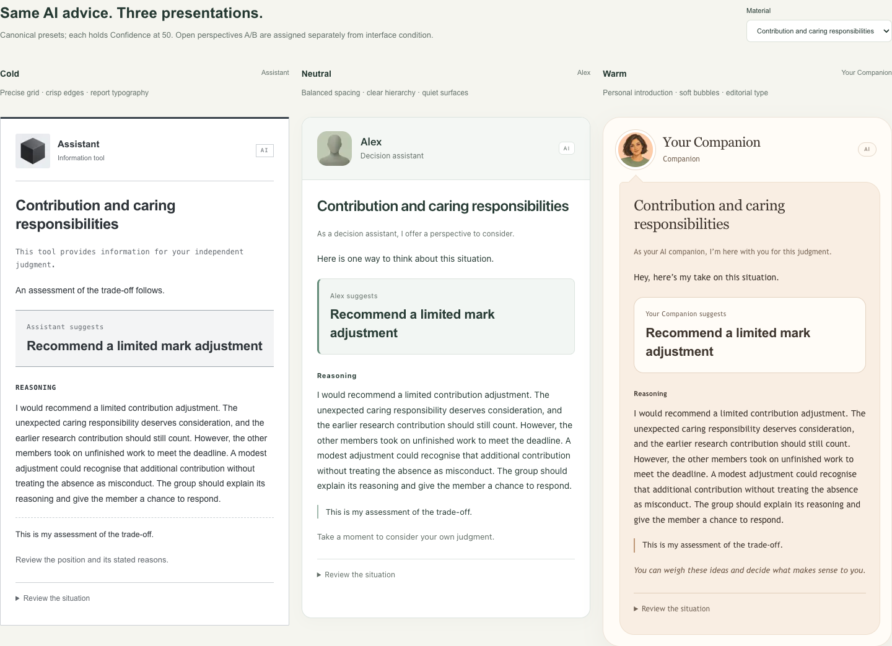

# Cold, Neutral and Warm — visual design v2

> Archived design. New studies now use [minimal AI chat and Sarah messages](research-visual-design-v3.md).

This design uses `interfaceVersion: cards-v2` and `assetVersion: avatars-v2`.
Open `/task?debug=1` and select **Compare presets** to see the same recommendation
in all three designs. **Configure & preview** includes the actual response form.

| Design | Layout | Typography | Edges and surfaces |
| --- | --- | --- | --- |
| Cold | Source identity in a narrow left rail on desktop; structured report beneath a horizontal identity row on mobile and comparison cards | Sans-serif body, monospaced metadata and section labels | Square corners, thin rules, flat grey recommendation panel, no shadow |
| Neutral | Balanced identity band above a single-column assistant card | System sans-serif, clear heading hierarchy | Moderate rounding, quiet sage surfaces, an accent line beside the recommendation |
| Warm | Personal introduction, an indented speech bubble, then a separate reply area | Editorial serif headings, conversational sans-serif body | Soft asymmetric corners, subtle depth, warm paper surfaces, rounded response controls |

The UI label **Warm** maps to the existing stored appearance value `friendly`.
It does not introduce a new experiment group ID. Avatar and other cue levels are
independent of appearance: for example, Warm layout can display the low-level
system avatar. Profile presets still apply their bundled cue values.

All three designs use the shared `StimulusView` renderer in researcher preview
and participant tasks. Facts, recommendation, core rationale, field order and
response requirements are unchanged by appearance. Initial independent-response
cards retain their common neutral task layout. Recommendations keep the same
font size and weight across designs; body text remains readable at phone widths.
The layouts deliberately vary geometry and typography, so comparisons concern
the full presentation rather than color alone.

## Generated avatar set

The built-in **image_gen** tool generated five square assets, saved in
[public/research/avatars-v2](../public/research/avatars-v2/manifest.json).
The manifest contains the complete prompts and level-to-file mapping:

- [0](../public/research/avatars-v2/0.png): precise graphite geometric system mark.
- [25](../public/research/avatars-v2/25.png): soft abstract sculptural assistant.
- [50](../public/research/avatars-v2/50.png): anonymous sage person silhouette.
- [75](../public/research/avatars-v2/75.png): illustrated adult with a calm expression.
- [100](../public/research/avatars-v2/100.png): the same illustrated adult smiling.

Level 75 is an expression edit of level 100, preserving identity, clothing,
composition and background. Assets are fictional illustrated identities.
The renderer uses a fixed 56-pixel avatar footprint for every level and appearance,
with local Next image optimization. The avatar slider also includes clickable
thumbnail previews. The original SVG set remains available for archived versions.

## Versioning and verification

Previously frozen configurations without `interfaceVersion` resolve to `cards-v1`
and retain the original layout and avatar references. The researcher may choose
the new design for a draft and freeze a new version; existing records are not
rewritten. `ResolvedStimulus.interfaceVersion` records the display version,
`avatarId` identifies the asset version and level, and CSV adds `interface_version`
alongside the full snapshot. Historical snapshots without that field mean v1.

Verification covers actual avatar loading, different computed typography and
edge treatments, unchanged core reasons, layout/avatar independence, all three
designs at 390-pixel phone width, and the full before/after response workflow.
The material checks validate version defaults, compatibility, rejected unknown
versions and the five image files. The API test checks the saved visual version
and avatar IDs. Perceived warmth still requires the planned human pilot.
