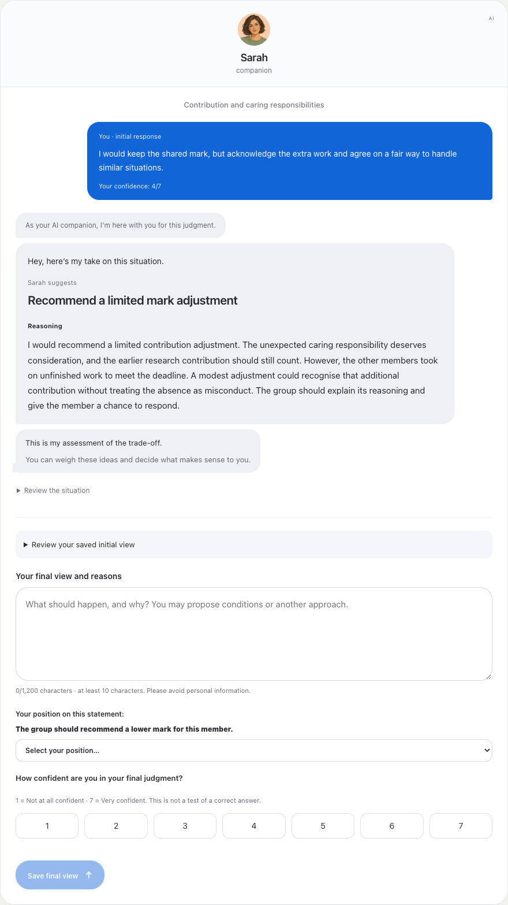

# Minimal AI chat and Sarah messages

Current two-part study presets use `cards-v3`, the existing `avatars-v2` image
set, and the versioned `names-v2` catalog. Open `/task?debug=1` → **Compare presets**.

- **Cold / Assistant** retains the previous report layout, metadata rail, thin
  lines, square corners and geometric avatar.
- **Neutral** uses an open white canvas, unboxed AI output, quiet typography and
  a rounded composer. It removes the enclosing card border, identity-band fill
  and the bordered recommendation panel.
- **Warm / Sarah** uses a centered contact header with the role underneath,
  left-aligned incoming message bubbles, the participant's real initial response
  on the right, and a blue submit control. It displays **Sarah** above **companion**
  in the default Warm profile; the small AI identifier remains visible.

The outgoing message contains the saved initial answer, never invented dialogue.
It appears only after an initial response exists. The AI message groups preserve
the fixed framing, tone, recommendation, core reasoning, certainty and personality
text. Recommendations retain the same size and weight across the three designs.
The form still requires the same judgment and self-confidence responses; it does
not become unrestricted live chat. No fake calls, typing indicators or read receipts
are added. Practice, preview and formal sessions share the renderer.

## References and design choices

The user requested a conventional AI chat presentation and an iMessage-like
conversation. We consulted the [ChatGPT overview](https://help.openai.com/en/articles/9125172)
and [Apple's Messages guide and conversation examples](https://support.apple.com/en-ie/guide/iphone/iph6c75e9c87/ios).
The borderless Neutral canvas and the contact-header/bubble hierarchy in Warm are
our adaptation for this study, not replicas or claims of affiliation. The existing
[generated avatar set and complete prompts](../public/research/avatars-v2/manifest.json)
remain unchanged.

## Names and frozen versions

`names-v2` contains Assistant / AI Assistant / Alex / Sam / Sarah at the five
name levels. These are editable presentation anchors rather than a validated
ordering of interpersonal closeness. Role wording remains controlled independently
by Framing. Warm displays that role in lowercase; other role choices still work.
Changing appearance alone changes neither the name nor any cue level.

The name catalog version is stored in `PresentationConfig.nameVersion`; resolved
snapshots record the actual name and `interfaceVersion: cards-v3`. Existing frozen
studies without the new name catalog keep their material-defined names, including
Your Companion. `cards-v1` and `cards-v2` remain renderable, and the researcher can
select an archived visual version in a draft. Changes create a new frozen version.

Verification covers full before/after workflows, five-level controls, identical
core reasoning across presets, new and archived names, actual saved initial text
in the thread, mobile overflow, fixed/user-set sessions, exports, lint, type checking
and production build. Numerical metrics and open-judgment coding are unchanged.

## Testing the selected interface in the participant demo

Choose a group or preset in **Configure & preview**, then click **Participant demo**.
It opens in a new tab and follows the selected profile, including individual cue
levels, name/asset versions and independent appearance. Changes in the researcher
panel update an already-open demo in the same browser and origin. Refreshing the
linked demo reloads the latest profile. The independent-response step intentionally
keeps the common neutral task layout; the AI identity appears after the first answer.

The demo toolbar identifies the active appearance/name, provides **Preview Cold**,
**Preview Neutral**, **Preview Warm**, **Follow researcher**, and **Restart demo**.
A local preset stops following the panel until reconnected. Switching presentations
preserves the current step and unsent form fields; restarting clears demo answers.
Refreshing starts the demo workflow again while retaining the linked profile.

Only a validated presentation profile and material-version identifier are stored
in browser local storage. Unsent answers stay in memory; researcher keys are never
shared. Frozen `study` links ignore this preview channel and never show demo controls.
If browser storage is unavailable, direct preset controls still work. Run
`npm run test:research:demo-sync` against an isolated server and Chrome to check
cross-tab changes, draft retention, malformed storage, refresh/restart, preview-only
events and frozen-session isolation.

The current two-part `/task` demo uses a 520px phone viewport on desktop, with a
screen-height scroll area and a separate control column. Compact demo spacing keeps
text and inputs together; advancing to another step returns the viewport to the top.
Changing a profile keeps the current scroll position and unsent answers. On narrow
mobile screens, the frame becomes an edge-to-edge page with normal browser scrolling.
These layout overrides are scoped to the demo; frozen study links retain their
versioned participant presentation.
